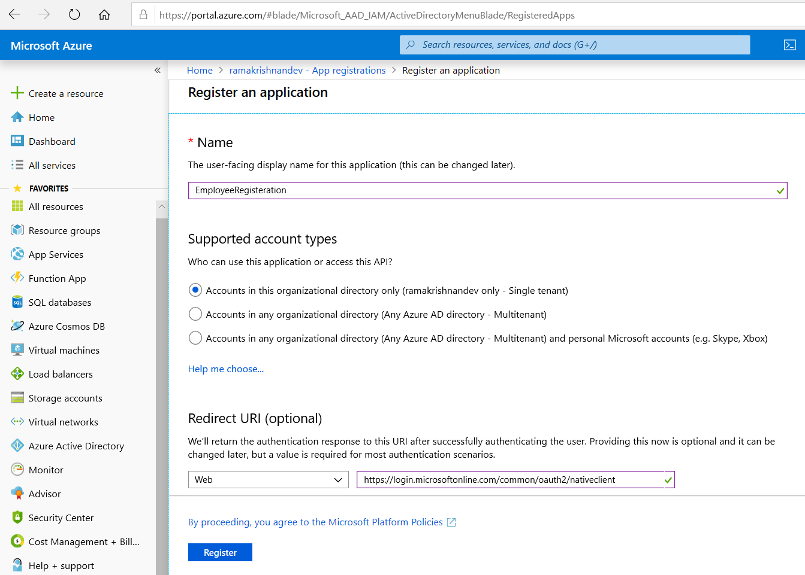
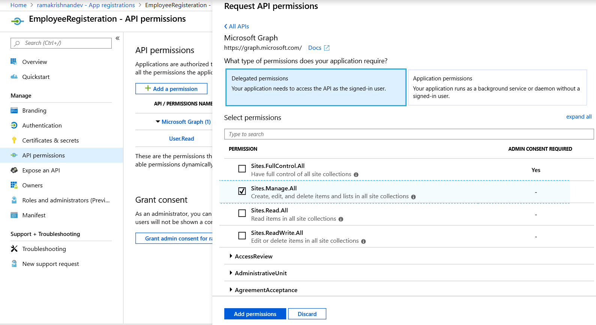
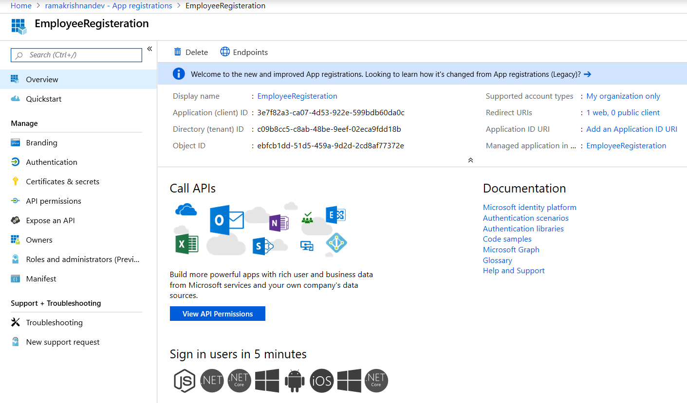

# Configuration for your new electronjs app

1\. Edit the name of your product in [package.json](./package.json) and the title of the [index.html](/src/index.html):

  ```json
  {
     "name": "YOUR_APP_NAME",
     "productName": "YOUR_APP_PRODUCT_NAME"
  }
  ```

  ```html
  <head>
     <title>YOUR_APP_NAME</title>
  </head>
  ```

2\. Edit Description of your project in [package.json](./package.json):

```json
{
    "description": "YOUR_APP_DESCRIPTION"
}
```

3\. Add author information to your project in the [package.json](./package.json):

```json
{
"author": {

    "name": "YOUR_NAME",
    "email": "YOUR_EMAIL"
    }
}
```

4\. Select youre license [(List of licenses)](https://spdx.org/licenses/):

```json
{
    "license": "YOUR_SELECTED_LICENSE"
}
```

5\. Set your app icon:

  ```json
  {
  "config": {

     "forge": {
         "packagerConfig": {
             "icon": "THE_PATH_TO_YOUR_APP_ICON"
         }
     }
  }
  ```

6\. Start writing your code:

    a. Set electron configuration in [index.ts](/src/index.ts).

    **IMPORTANT: Do not turn on webSecurity when running** `npm run production` **,** `npm run make` **or** `npm run publish`**, as it will result in not showing your selected HTML-Site.**

    b. To run code in WebContext use [renderer.ts](/src/renderer.ts).

    c. Change the contents of the [index.html](/src/index.html) according to your needs.

7\. You can add packages according to your needs with `npm i --save YOUR_PACKAGE_NAME` or if its a developement-tool with `npm i --save-dev YOUR_PACKAGE_NAME` .

8\. Register an Application in Azure [Source](https://www.linkedin.com/pulse/create-electron-application-interact-sharepoint-using-raman)

    Create \ Register an Azure Application and Grant the required permission.
    Follow the steps specified below to register a new application and assign the required permission.

    1\) Sign in to the Azure portal using tenant admin account.

    If the account that is being used has access to more than one tenant, select the particular account in the top right corner, and set portal session to the Azure AD tenant that needs to be used.

    2\) In the left-hand navigation pane, select the Azure Active Directory service and then select App registrations > New registration.

    Provide a name (Here its EmployeeRegisteration) and under Redirect URI enter `https://login.microsoftonline.com/common/oauth2/nativeclient`

    Click Register.

    

    3\) Go to API permission and click on Add permission. Select Microsoft Graph option and then select Delegated Permission. Since we are requesting sign-in credentials from logged in user, we are selecting delegated permission. Select the necesarry permissions and click "Add permissions".

    

    4\) Go to Authentication, select 'Access Tokens' under Advance Settings -> Implicit Grant category & Click 'Save'.

    

9\. In order to interact with the MicrosoftGraph during developement properly, create a file [.env](/.env). Add the following code and fill out the placeholders with the Information above:

```bash
REDIRECT_URL=<Your redirecht url of the client>
TENANT_ID=<The id of your Microsoft tenant>
CLIENT_ID=<The id of your Client application>
RESOURCE=<The id of the resource>
```
